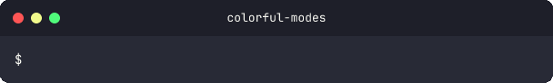
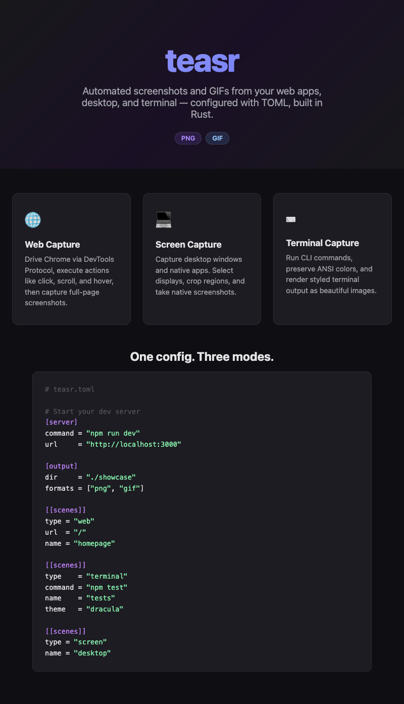

<p align="center">
  <h1 align="center">teasr</h1>
  <p align="center">
    Automated project showcase capture — screenshots and GIFs from web apps, desktop, and terminal. Single binary, no runtime dependencies.
    <br /><br />
    <a href="https://github.com/urmzd/teasr/releases">Download</a>
    &middot;
    <a href="https://github.com/urmzd/teasr/issues">Report Bug</a>
    &middot;
    <a href="https://github.com/urmzd/teasr/blob/main/.github/actions/teasr/action.yml">CI Integration</a>
  </p>
</p>

<p align="center">
  <a href="https://github.com/urmzd/teasr/actions/workflows/ci.yml"></a>
</p>

## Showcase

<table>
  <tr>
    <td align="center"><strong>CLI Help</strong></td>
    <td align="center"><strong>Colorful Output</strong></td>
  </tr>
  <tr>
    <td></td>
    <td></td>
  </tr>
  <tr>
    <td align="center" colspan="2"><strong>Web Capture</strong></td>
  </tr>
  <tr>
    <td align="center" colspan="2"></td>
  </tr>
</table>

## Why teasr

| | teasr | Node/Playwright approach |
|---|---|---|
| Runtime | Single binary | Node.js + npm install |
| Terminal render | Built-in (ANSI → SVG → PNG) | External tools |
| GIF encoding | gifski (pure Rust) | FFmpeg or ImageMagick |
| Config | `teasr.toml` | JS/TS config file |
| Server cleanup | Process group kill | Manual or best-effort |

## Installation

**Shell installer (recommended):**

```bash
curl -fsSL https://raw.githubusercontent.com/urmzd/teasr/main/install.sh | bash
```

**Cargo:**

```bash
cargo install teasr-cli
```

**GitHub Action:** see [CI Integration](#ci-integration) below.

## Quick Start

Create `teasr.toml` in your project root:

```toml
[server]
command = "npx serve examples/demo --listen 3123"
url = "http://localhost:3123"
timeout = 10000

[output]
dir = "./showcase"
formats = ["png"]

[[scenes]]
type = "web"
url = "/"
name = "demo-landing"

[[scenes]]
type = "terminal"
name = "cli-help"
theme = "dracula"
cols = 90
rows = 24
formats = ["gif", "png"]
frame_duration = 80

[[scenes.steps]]
type = "type"
text = "teasr --help"
speed = 50

[[scenes.steps]]
type = "key"
key = "enter"

[[scenes.steps]]
type = "wait"
duration = 2000
```

Then run:

```bash
teasr
```

Output files are written to `./showcase/`.

## Capture Modes

### Web

Navigates to a URL via Chrome DevTools Protocol (chromiumoxide). Requires Chrome or Chromium to be installed.

```toml
[[scenes]]
type = "web"
url = "/dashboard"
name = "dashboard"

# Optional
viewport = { width = 1440, height = 900 }
formats = ["png", "gif"]

[[scenes.actions]]
type = "click"
selector = "#open-modal"

[[scenes.actions]]
type = "screenshot"
name = "modal-open"
```

**Web scene fields:**

| Field | Type | Default | Description |
|-------|------|---------|-------------|
| `url` | string | required | Path (joined to `server.url`) or full URL |
| `name` | string | url value | Output filename base |
| `viewport` | object | `1280x720` | `{ width, height }` |
| `formats` | array | `output.formats` | Per-scene format override |
| `actions` | array | — | Sequence of interactions before capture |

**Action types:** `click`, `scroll-to`, `hover`, `wait`, `screenshot`

### Terminal

Scripts an interactive PTY session using steps (type, key, wait), captures frames at each step, and renders them as animated GIFs or PNGs with terminal chrome (title bar, traffic light buttons).

```toml
[[scenes]]
type = "terminal"
name = "test-output"
theme = "dracula"
cols = 100
rows = 24
formats = ["gif", "png"]
frame_duration = 80

[[scenes.steps]]
type = "type"
text = "cargo test 2>&1"
speed = 50

[[scenes.steps]]
type = "key"
key = "enter"

[[scenes.steps]]
type = "wait"
duration = 2000
```

**Terminal scene fields:**

| Field | Type | Default | Description |
|-------|------|---------|-------------|
| `name` | string | required | Output filename base |
| `theme` | string | `"dracula"` | `"dracula"` or `"monokai"` |
| `cols` | integer | `80` | Terminal width in columns |
| `rows` | integer | `24` | Terminal height in rows |
| `steps` | array | required | Sequence of steps to record |
| `frame_duration` | integer | `80` | Milliseconds per frame in GIF output |
| `formats` | array | `output.formats` | Per-scene format override |

**Step types:**

| Type | Fields | Description |
|------|--------|-------------|
| `type` | `text`, `speed` (ms per char, optional) | Type text into the terminal |
| `key` | `key` (e.g. `"enter"`) | Press a key |
| `wait` | `duration` (ms, optional) | Wait before next step |

### Screen

Captures a display or region using native screen capture (xcap).

```toml
[[scenes]]
type = "screen"
name = "native-app"
display = 0
setup = "open MyApp.app"
delay = 2000
```

**Screen scene fields:**

| Field | Type | Default | Description |
|-------|------|---------|-------------|
| `name` | string | `"screen"` | Output filename base |
| `display` | integer | primary | Display index |
| `region` | object | full display | `{ x, y, width, height }` |
| `setup` | string | — | Shell command run before capture |
| `delay` | integer | — | Milliseconds to wait after setup |
| `formats` | array | `output.formats` | Per-scene format override |

## Configuration Reference

### `[server]`

Optional. Starts a process before capture and health-polls it until ready. The process group is killed on exit — no orphaned processes.

```toml
[server]
command = "npm run dev"
url = "http://localhost:3000"
timeout = 10000          # ms to wait for server to be ready (default: 10000)
```

### `[output]`

```toml
[output]
dir = "./showcase"       # default: "./teasr-output"
formats = ["png"]        # default: ["png"]. Options: "png", "gif"
```

### `[[scenes]]`

Each `[[scenes]]` entry is one of the three types described above. The `type` field is required and must be `"web"`, `"terminal"`, or `"screen"`.

Config file discovery walks up from the current directory to the filesystem root, so running `teasr` from any subdirectory of your project will find `teasr.toml` at the root.

## CLI Reference

```
teasr [OPTIONS]

Options:
  -c, --config <PATH>      Path to teasr.toml (default: auto-discover)
  -o, --output <DIR>       Output directory (overrides config)
      --formats <FMT,...>  Output formats: png, gif (overrides config)
      --verbose            Enable debug logging
      --timeout <MS>       Global timeout in ms [default: 60000]
  -h, --help               Print help
  -V, --version            Print version
```

`--formats` accepts comma-separated values: `--formats png,gif`

## Output Formats

| Format | Notes |
|--------|-------|
| `png` | Lossless screenshot. Native, no external tools required. |
| `gif` | Animated GIF from multi-frame session recording, encoded with gifski (pure Rust). |

## CI Integration

The GitHub Action downloads the appropriate pre-built binary, installs Chrome, runs teasr, and uploads output as a build artifact.

```yaml
- uses: urmzd/teasr/.github/actions/teasr@main
  with:
    config: "teasr.toml"     # optional, auto-discovered if omitted
    formats: "png"            # optional, overrides config
    output: "./showcase"      # optional, default: ./teasr-output
    version: "latest"         # optional, pin to e.g. "0.2.0"
```

**Outputs:**

| Output | Description |
|--------|-------------|
| `output-dir` | Path to the directory containing captured assets |

**Supported runners:** `ubuntu-*`, `macos-*`, `windows-*` on x64 and ARM64.

## Workspace

teasr is a Cargo workspace with three crates:

| Crate | Description |
|-------|-------------|
| [`teasr-cli`](crates/teasr-cli) | CLI entry point (`teasr` binary) |
| [`teasr-core`](crates/teasr-core) | Capture, config, and orchestration library |
| [`teasr-term-render`](crates/teasr-term-render) | ANSI → SVG → PNG rendering library |

## Agent Skill

```bash
npx skills add urmzd/teasr
```

## License

Apache-2.0
