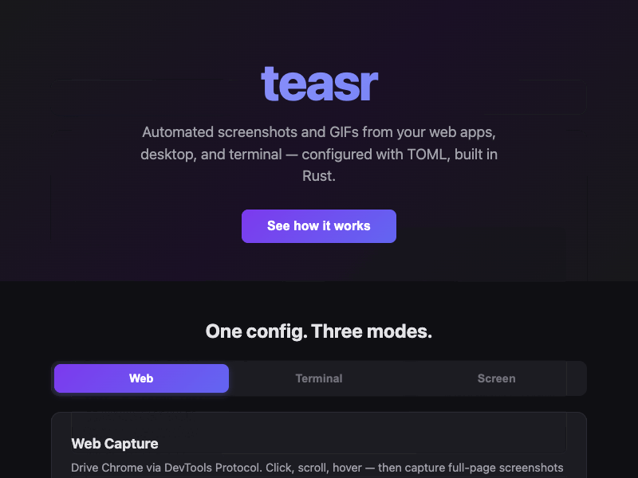
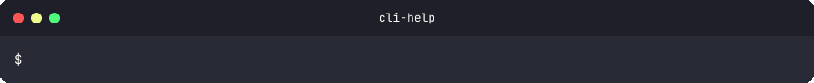
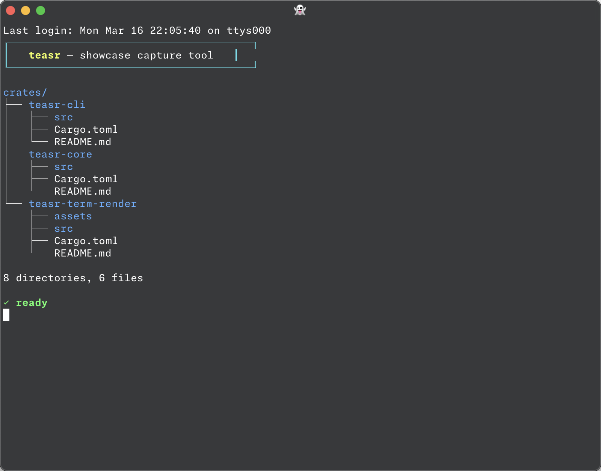

<p align="center">
  <h1 align="center">teasr</h1>
  <p align="center">
    Automated project showcase capture — screenshots and GIFs from web apps, desktop, and terminal. Single binary, no runtime dependencies.
    <br /><br />
    <a href="https://github.com/urmzd/teasr/releases">Download</a>
    &middot;
    <a href="https://github.com/urmzd/teasr/issues">Report Bug</a>
    &middot;
    <a href="https://github.com/urmzd/teasr/blob/main/.github/actions/teasr/action.yml">CI Integration</a>
  </p>
</p>

<p align="center">
  <a href="https://github.com/urmzd/teasr/actions/workflows/ci.yml"></a>
</p>

## Showcase

<p align="center">
  <strong>Web Capture</strong><br>
  
</p>

<p align="center">
  <strong>Terminal Capture</strong><br>
  
</p>

<p align="center">
  <strong>Screen Capture</strong><br>
  
</p>

## Why teasr

| | teasr | Node/Playwright approach |
|---|---|---|
| Runtime | Single binary | Node.js + npm install |
| Terminal render | Built-in (ANSI → SVG → PNG) | External tools |
| GIF encoding | gifski (pure Rust) | FFmpeg or ImageMagick |
| Config | `teasr.toml` | JS/TS config file |
| Server cleanup | Process group kill | Manual or best-effort |

## Installation

**Shell installer (recommended):**

```bash
curl -fsSL https://raw.githubusercontent.com/urmzd/teasr/main/install.sh | bash
```

**Cargo:**

```bash
cargo install teasr-cli
```

**GitHub Action:** see [CI Integration](#ci-integration) below.

## Quick Start

Create `teasr.toml` in your project root:

```toml
[server]
command = "npm run dev"
url = "http://localhost:3000"
timeout = 10000

[output]
dir = "./showcase"
formats = [{ output_type = "png" }]

[[scenes]]
type = "web"
url = "/"
name = "homepage"
formats = [{ output_type = "gif" }, { output_type = "png" }]

[[scenes.interactions]]
type = "snapshot"

[[scenes.interactions]]
type = "click"
selector = "#get-started"

[[scenes.interactions]]
type = "snapshot"

[[scenes]]
type = "terminal"
name = "cli-help"
theme = "dracula"
cols = 90
rows = 24
formats = [{ output_type = "gif" }, { output_type = "png" }]

[[scenes.interactions]]
type = "type"
text = "teasr --help"
speed = 50

[[scenes.interactions]]
type = "key"
key = "enter"

[[scenes.interactions]]
type = "wait"
duration = 2000
```

Then run:

```bash
teasr showme
```

Output files are written to `./showcase/`.

## Capture Modes

All three capture modes use a unified `[[scenes.interactions]]` syntax. Every interaction type is accepted by every mode — unsupported interactions are silently skipped (visible with `--verbose`).

### Interaction Types

| Type | Fields | Description |
|------|--------|-------------|
| `type` | `text`, `speed` (ms per char, optional) | Type text (terminal: PTY input, web: keyboard events) |
| `key` | `key` (e.g. `"enter"`) | Press a key |
| `click` | `selector` (CSS selector, optional) | Click an element |
| `hover` | `selector` (CSS selector, optional) | Hover over an element |
| `scroll-to` | `selector` (CSS selector, optional) | Scroll an element into view |
| `wait` | `duration` (ms, default 1000) | Pause before next interaction |
| `snapshot` | `name` (optional) | Capture the current state as a frame |

### Web

Navigates to a URL via Chrome DevTools Protocol (chromiumoxide). Requires Chrome or Chromium to be installed.

```toml
[[scenes]]
type = "web"
url = "/dashboard"
name = "dashboard"

# Optional
viewport = { width = 1440, height = 900 }
formats = [{ output_type = "png" }, { output_type = "gif" }]

[[scenes.interactions]]
type = "click"
selector = "#open-modal"

[[scenes.interactions]]
type = "snapshot"
name = "modal-open"
```

**Web scene fields:**

| Field | Type | Default | Description |
|-------|------|---------|-------------|
| `url` | string | required | Path (joined to `server.url`) or full URL |
| `name` | string | url value | Output filename base |
| `viewport` | object | `1280x720` | `{ width, height }` |
| `formats` | array | `output.formats` | Per-scene format override (`[{ output_type = "png" }]`) |
| `interactions` | array | `[]` | Sequence of interactions |
| `full_page` | boolean | — | Capture full page height or just viewport |
| `frame_duration` | integer | `100` | Milliseconds per frame in GIF output |

**Supported interactions:** `click`, `hover`, `scroll-to`, `wait`, `snapshot`, `type`, `key`

### Terminal

Scripts an interactive PTY session, captures frames at each interaction, and renders them as animated GIFs or PNGs with terminal chrome (title bar, traffic light buttons).

```toml
[[scenes]]
type = "terminal"
name = "test-output"
theme = "dracula"
cols = 100
rows = 24
formats = [{ output_type = "gif" }, { output_type = "png" }]
frame_duration = 80

[[scenes.interactions]]
type = "type"
text = "cargo test 2>&1"
speed = 50

[[scenes.interactions]]
type = "key"
key = "enter"

[[scenes.interactions]]
type = "wait"
duration = 2000
```

**Terminal scene fields:**

| Field | Type | Default | Description |
|-------|------|---------|-------------|
| `name` | string | `"recording"` | Output filename base |
| `theme` | string | `"dracula"` | `"dracula"` or `"monokai"` |
| `cols` | integer | `80` | Terminal width in columns |
| `rows` | integer | `24` | Terminal height in rows |
| `interactions` | array | `[]` | Sequence of interactions |
| `frame_duration` | integer | `100` | Milliseconds per frame in GIF output |
| `formats` | array | `output.formats` | Per-scene format override |

**Supported interactions:** `type`, `key`, `wait`, `snapshot`

### Screen

Captures a display, window, or region using native screen capture (xcap). Screenshots are automatically wrapped in macOS-style window chrome (matching terminal output). Supports multi-frame GIF output when multiple `snapshot` + `wait` interactions are configured.

```toml
[[scenes]]
type = "screen"
name = "native-app"
setup = "open MyApp.app"
delay = 2000
theme = "dracula"
title = "My App"
formats = [{ output_type = "gif" }, { output_type = "png" }]

[[scenes.interactions]]
type = "snapshot"

[[scenes.interactions]]
type = "wait"
duration = 1000

[[scenes.interactions]]
type = "snapshot"
```

**Screen scene fields:**

| Field | Type | Default | Description |
|-------|------|---------|-------------|
| `name` | string | `"screen"` | Output filename base |
| `display` | integer | primary | Display index (ignored if `window` is set) |
| `window` | string | — | Window title or app name substring (case-insensitive) |
| `region` | object | full display | `{ x, y, width, height }` |
| `setup` | string | — | Shell command run before capture |
| `delay` | integer | — | Milliseconds to wait after setup |
| `interactions` | array | `[]` | Sequence of interactions |
| `frame_duration` | integer | `100` | Milliseconds per frame in GIF output |
| `title` | string | `"Screen Capture"` | Title shown in chrome frame title bar |
| `theme` | string | `"dracula"` | Chrome frame theme: `"dracula"` or `"monokai"` |
| `formats` | array | `output.formats` | Per-scene format override |

**Supported interactions:** `snapshot`, `wait`

## Configuration Reference

### `[server]`

Optional. Starts a process before capture and health-polls it until ready. The process group is killed on exit — no orphaned processes.

```toml
[server]
command = "npm run dev"
url = "http://localhost:3000"
timeout = 10000          # ms to wait for server to be ready (default: 10000)
```

### `[output]`

```toml
[output]
dir = "./showcase"       # default: "./teasr-output"
formats = [{ output_type = "png" }]  # default: [{ output_type = "png" }]. Options: "png", "gif", "mp4"
```

### `[[scenes]]`

Each `[[scenes]]` entry is one of the three types described above. The `type` field is required and must be `"web"`, `"terminal"`, or `"screen"`.

Config file discovery walks up from the current directory to the filesystem root, so running `teasr` from any subdirectory of your project will find `teasr.toml` at the root.

## CLI Reference

```
teasr [COMMAND]

Commands:
  showme  Run capture scenes from teasr.toml
  help    Print this message or the help of the given subcommand(s)

Options:
  -h, --help     Print help
  -V, --version  Print version
```

### `teasr showme`

```
teasr showme [OPTIONS]

Options:
  -c, --config <PATH>      Path to teasr.toml (default: auto-discover)
  -o, --output <DIR>       Output directory (overrides config)
      --formats <FMT,...>  Output formats: png, gif, mp4 (overrides config)
      --verbose            Enable debug logging
      --timeout <MS>       Global timeout in ms [default: 60000]
      --fps <N>            Frames per second (overrides config)
      --seconds <N>        Target output duration in seconds (overrides config)
      --scene-timeout <N>  Per-scene wall-clock timeout in seconds (overrides config)
  -h, --help               Print help
```

`--formats` accepts comma-separated values: `--formats png,gif,mp4`

## Output Formats

| Format | Notes |
|--------|-------|
| `png` | Lossless screenshot. Native, no external tools required. |
| `gif` | Animated GIF from multi-frame session recording, encoded with gifski (pure Rust). |
| `mp4` | Video output from multi-frame session recording. |

## CI Integration

The GitHub Action downloads the appropriate pre-built binary, installs Chrome, and runs `teasr showme`. All configuration comes from `teasr.toml`.

```yaml
- uses: urmzd/teasr/.github/actions/teasr@main
  with:
    version: "latest"  # optional, pin to e.g. "0.7.0"
```

**Supported runners:** `ubuntu-*`, `macos-*`, `windows-*` on x64 and ARM64.

## Workspace

teasr is a Cargo workspace with three crates:

| Crate | Description |
|-------|-------------|
| [`teasr-cli`](crates/teasr-cli) | CLI entry point (`teasr` binary) |
| [`teasr-core`](crates/teasr-core) | Capture, config, and orchestration library |
| [`teasr-term-render`](crates/teasr-term-render) | ANSI → SVG → PNG rendering library |

## Agent Skill

```bash
npx skills add urmzd/teasr
```

## License

Apache-2.0
