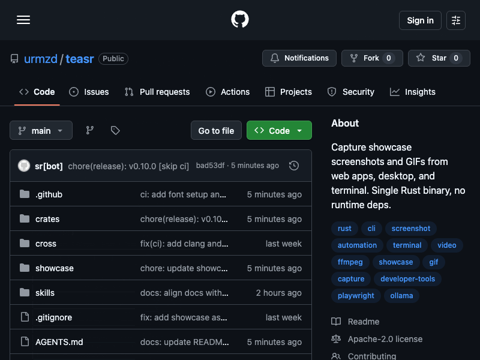
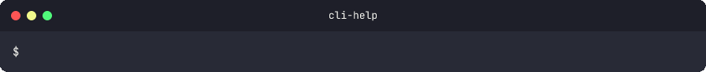

<p align="center">
  <h1 align="center">teasr</h1>
  <p align="center">
    Automated project showcase capture — screenshots and GIFs from web apps, desktop, and terminal. Single binary, no runtime dependencies.
    <br /><br />
    <a href="https://github.com/urmzd/teasr/releases">Download</a>
    &middot;
    <a href="https://github.com/urmzd/teasr/issues">Report Bug</a>
    &middot;
    <a href="https://github.com/urmzd/teasr/blob/main/action.yml">CI Integration</a>
  </p>
</p>

<p align="center">
  <a href="https://github.com/urmzd/teasr/actions/workflows/ci.yml"></a>
  <a href="https://crates.io/crates/teasr"></a>
  &nbsp;
  <a href="LICENSE"></a>
</p>

## Showcase

<table align="center">
  <tr>
    <td align="center"><strong>Web Capture</strong></td>
    <td align="center"><strong>Terminal Capture</strong></td>
  </tr>
  <tr>
    <td align="center"></td>
    <td align="center"></td>
  </tr>
  <tr>
    <td align="center"><strong>Local HTML</strong></td>
    <td align="center"><strong>Markdown</strong></td>
  </tr>
  <tr>
    <td align="center"></td>
    <td align="center"></td>
  </tr>
</table>

## Contents

- [Why teasr](#why-teasr)
- [Installation](#installation)
- [Quick Start](#quick-start)
- [Capture Modes](#capture-modes)
- [Configuration Reference](#configuration-reference)
- [CLI Reference](#cli-reference)
- [Output Formats](#output-formats)
- [CI Integration](#ci-integration)
- [Workspace](#workspace)
- [Agent Skill](#agent-skill)
- [License](#license)

## Why teasr

| | teasr | Node/Playwright approach |
|---|---|---|
| Runtime | Single binary | Node.js + npm install |
| Terminal render | Built-in (ANSI → SVG → PNG) | External tools |
| GIF encoding | gifski (pure Rust) | FFmpeg or ImageMagick |
| Config | `teasr.toml` | JS/TS config file |
| Server cleanup | Process group kill | Manual or best-effort |

## Installation

**Shell installer (recommended):**

```bash
curl -fsSL https://raw.githubusercontent.com/urmzd/teasr/main/install.sh | sh
```

**Cargo:**

```bash
cargo install teasr-cli
```

**GitHub Action:** see [CI Integration](#ci-integration) below.

## Quick Start

Create `teasr.toml` in your project root:

```toml
[server]
command = "npm run dev"
url = "http://localhost:3000"
timeout = 10000

[output]
dir = "./showcase"
formats = [{ output_type = "png" }]

[[scenes]]
type = "web"
uri = "/"
name = "homepage"
formats = [{ output_type = "gif" }, { output_type = "png" }]

[[scenes.interactions]]
type = "snapshot"

[[scenes.interactions]]
type = "click"
selector = "#get-started"

[[scenes.interactions]]
type = "snapshot"

[[scenes]]
type = "terminal"
name = "cli-help"
theme = "dracula"
cols = 90
rows = 24
formats = [{ output_type = "gif" }, { output_type = "png" }]

[[scenes.interactions]]
type = "type"
text = "teasr --help"
speed = 50

[[scenes.interactions]]
type = "key"
key = "enter"

[[scenes.interactions]]
type = "wait"
duration = 2000
```

Then run:

```bash
teasr run
```

Output files are written to `./showcase/`.

## Capture Modes

All three capture modes — `terminal`, `web`, `screen` — use a unified `[[scenes.interactions]]` syntax. Every interaction type is accepted by every mode; unsupported interactions are silently skipped (visible with `--verbose`). The `web` scene loads remote URLs, local files (HTML/SVG/PDF), or Markdown files through the same headless-Chrome renderer.

### Interaction Types

| Type | Fields | Description |
|------|--------|-------------|
| `type` | `text`, `speed` (ms per char, optional) | Type text (terminal: PTY input, web: keyboard events) |
| `key` | `key` (e.g. `"enter"`) | Press a key |
| `click` | `selector` (CSS selector, optional) | Click an element |
| `hover` | `selector` (CSS selector, optional) | Hover over an element |
| `scroll-to` | `selector` (CSS selector, optional) | Scroll an element into view |
| `wait` | `duration` (ms, default 1000) | Pause. Terminal/screen emit one frame at the end of the pause (`duration_ms = duration`); web emits nothing — follow with `snapshot` to capture post-pause state. |
| `snapshot` | `name` (optional) | Capture the current state as a frame |

Every interaction also accepts a `hidden` flag (default `false`). Hidden interactions execute normally but their frames are excluded from output — useful for setup steps (e.g. typing a command) that should not appear in the final GIF or screenshot.

```toml
[[scenes.interactions]]
type = "type"
text = "cd my-project"
hidden = true

[[scenes.interactions]]
type = "key"
key = "enter"
hidden = true

[[scenes.interactions]]
type = "wait"
duration = 500
hidden = true
```

### Web

Loads a URI in headless Chrome (via chromiumoxide). The `uri` field picks what to load:

- `http://` / `https://` — remote URL (a leading `/` joins against `[server].url` if configured)
- `*.md` / `*.markdown` — Markdown file rendered to styled HTML
- anything else — local file (HTML, SVG, PDF) loaded via `file://`

Requires Chrome or Chromium to be installed.

```toml
# Remote URL (or server-relative path with [server])
[[scenes]]
type = "web"
uri = "/dashboard"
name = "dashboard"
viewport = { width = 1440, height = 900 }
formats = [{ output_type = "png" }, { output_type = "gif" }]

[[scenes.interactions]]
type = "click"
selector = "#open-modal"

[[scenes.interactions]]
type = "snapshot"
name = "modal-open"

# Local HTML / SVG
[[scenes]]
type = "web"
uri = "./docs/preview.html"
name = "docs-preview"

[[scenes.interactions]]
type = "snapshot"

# PDF (page selection via the `page` field)
[[scenes]]
type = "web"
uri = "./spec.pdf"
page = 2

[[scenes.interactions]]
type = "snapshot"

# Markdown (rendered with the bundled GitHub-style template)
[[scenes]]
type = "web"
uri = "./README.md"
theme = "dark"           # "light" (default) or "dark"
flavor = "github"        # "github" (default), "commonmark", or "custom"
full_page = true

[[scenes.interactions]]
type = "snapshot"
```

**Web scene fields:**

| Field | Type | Default | Description |
|-------|------|---------|-------------|
| `uri` | string | required | Remote URL, server-relative path, local file, or Markdown file |
| `name` | string | uri value | Output filename base |
| `viewport` | object | `1280x720` | `{ width, height }` |
| `formats` | array | `output.formats` | Per-scene format override |
| `interactions` | array | `[]` | Sequence of interactions |
| `full_page` | boolean | `false` | Capture full page height instead of just the viewport |
| `frame_duration` | integer | `100` | Milliseconds per frame in GIF output |
| `page` | integer | `1` | PDF page to capture (only applies when `uri` is a PDF) |
| `theme` | string | `"light"` | Markdown theme: `"light"` or `"dark"` (Markdown only) |
| `redact` | table | — | PII redaction overrides for this scene (see [`[redact]`](#redact)) |
| `flavor` | string | `"github"` | Markdown flavor: `"github"`, `"commonmark"`, `"custom"` (Markdown only) |
| `stylesheet` | string | — | Path to a custom CSS file appended after the default styles (Markdown only) |
| `template` | string | — | Path to a full HTML template with `{{content}}` placeholder; overrides the default template (Markdown only) |

**Markdown flavor details:**

| Flavor | Behavior |
|--------|----------|
| `github` | GitHub Flavored Markdown — tables, task lists, autolinks, strikethrough, footnotes |
| `commonmark` | Strict CommonMark — no extensions |
| `custom` | GFM extensions enabled; pair with `stylesheet` to apply your own visual style |

**Supported interactions:** `click`, `hover`, `scroll-to`, `wait`, `snapshot`, `type`, `key`

### Terminal

Scripts an interactive PTY session, captures frames at each interaction, and renders them as animated GIFs or PNGs with terminal chrome (title bar, traffic light buttons).

```toml
[[scenes]]
type = "terminal"
name = "test-output"
theme = "dracula"
cols = 100
rows = 24
formats = [{ output_type = "gif" }, { output_type = "png" }]
frame_duration = 80

[[scenes.interactions]]
type = "type"
text = "cargo test 2>&1"
speed = 50

[[scenes.interactions]]
type = "key"
key = "enter"

[[scenes.interactions]]
type = "wait"
duration = 2000
```

**Terminal scene fields:**

| Field | Type | Default | Description |
|-------|------|---------|-------------|
| `name` | string | `"recording"` | Output filename base |
| `theme` | string | `"dracula"` | `"dracula"` or `"monokai"` |
| `cols` | integer | `80` | Terminal width in columns |
| `rows` | integer | `24` | Terminal height in rows |
| `interactions` | array | `[]` | Sequence of interactions |
| `frame_duration` | integer | `100` | Milliseconds per frame in GIF output |
| `formats` | array | `output.formats` | Per-scene format override |
| `redact` | table | — | PII redaction overrides for this scene (see [`[redact]`](#redact)) |

**Supported interactions:** `type`, `key`, `wait`, `snapshot`

### Screen

Captures a display, window, or region using native screen capture (xcap). Screenshots are automatically wrapped in macOS-style window chrome (matching terminal output). Supports multi-frame GIF output when multiple `snapshot` + `wait` interactions are configured.

> [!WARNING]
> Screen captures record whatever is visible on your display — notifications, browser tabs, menu bar items, and other windows may contain personal information (emails, names, tokens, messages). Always review the output before publishing it. Prefer capturing a specific `window` or `region` over a full display to limit exposure, and use [`[redact]`](#redact) to hide known-sensitive areas.

```toml
[[scenes]]
type = "screen"
name = "native-app"
setup = "open MyApp.app"
delay = 2000
theme = "dracula"
title = "My App"
formats = [{ output_type = "gif" }, { output_type = "png" }]

[[scenes.interactions]]
type = "snapshot"

[[scenes.interactions]]
type = "wait"
duration = 1000

[[scenes.interactions]]
type = "snapshot"
```

**Screen scene fields:**

| Field | Type | Default | Description |
|-------|------|---------|-------------|
| `name` | string | `"screen"` | Output filename base |
| `display` | integer | primary | Display index (ignored if `window` is set) |
| `window` | string | — | Window title or app name substring (case-insensitive) |
| `region` | object | full display | `{ x, y, width, height }` |
| `setup` | string | — | Shell command run before capture |
| `delay` | integer | — | Milliseconds to wait after setup |
| `interactions` | array | `[]` | Sequence of interactions |
| `frame_duration` | integer | `100` | Milliseconds per frame in GIF output |
| `title` | string | `"Screen Capture"` | Title shown in chrome frame title bar |
| `theme` | string | `"dracula"` | Chrome frame theme: `"dracula"` or `"monokai"` |
| `formats` | array | `output.formats` | Per-scene format override |
| `redact` | table | — | PII redaction overrides for this scene (see [`[redact]`](#redact)) |

**Supported interactions:** `snapshot`, `wait`

## Configuration Reference

### `[server]`

Optional. Starts a process before capture and health-polls it until ready. The process group is killed on exit — no orphaned processes.

```toml
[server]
command = "npm run dev"
url = "http://localhost:3000"
timeout = 10000          # ms to wait for server to be ready (default: 10000)
```

### `[redact]`

Optional. Hides PII and secrets in captured output. Configure globally with `[redact]` (applies to every scene) and/or per scene with `[scenes.redact]` — scene lists extend the global lists, scene scalars override global ones.

```toml
[redact]
patterns = ["email", "secrets"]   # built-in pattern names (see table below)
custom = ['acme-[0-9a-f]{16}']    # extra regexes (single-quote to avoid TOML escapes)
literals = ["internal-host"]      # exact strings to mask
username = true                   # mask $USER, the hostname, and home-directory paths
mask = "•"                        # replacement character (default: "•")
style = "block"                   # default region/selector style: "block", "blur", "pixelate"

[[scenes]]
type = "web"
uri = "/dashboard"

[scenes.redact]
selectors = [".user-email", "#avatar"]   # CSS selectors masked with page overlays (web only)

[[scenes.redact.regions]]                # pixel rectangles hidden in every frame (any scene type)
x = 840
y = 12
width = 220
height = 32
style = "pixelate"                       # optional per-region override
```

How each mechanism applies:

| Mechanism | Scene types | How it works |
|---|---|---|
| `patterns` / `custom` / `literals` / `username` | terminal | Matched text is replaced character-for-character with `mask` on the terminal grid *before* rendering — layout and colors are untouched, and tokens that wrap across lines are still caught. |
| `selectors` | web | Each matching element is covered with an overlay before every screenshot (solid fill, or backdrop blur when `style = "blur"`; `pixelate` falls back to solid). Works with `full_page` and GIFs. |
| `regions` | all | The rectangle is blocked, blurred, or pixelated in every captured frame. For screen scenes this happens on the raw capture (before window chrome), with coordinates relative to the captured/cropped area. |

**Built-in patterns:** `email`, `ipv4`, `ipv6`, `ssn`, `credit-card`, `phone`, `home-path`, and the token patterns `aws-key`, `github-token`, `slack-token`, `google-api-key`, `stripe-key`, `openai-key`, `anthropic-key`, `npm-token`, `jwt`, `private-key`, `bearer-token`. The name `secrets` expands to all of the token patterns at once.

**Limitations — still review before publishing:**

- Pattern matching needs the whole token visible. A secret *typed on camera* leaks in intermediate frames (each keystroke shows a partial token no pattern can match) and its shell echo can scroll apart. Type secrets in `hidden = true` steps instead, and let redaction handle program *output*.
- Terminal patterns see text; web and screen frames are pixels, so those modes rely on `selectors` and `regions` — they hide what you tell them to, not what they detect.
- `blur` leaves recognizable shapes; prefer `block` (the default) for anything genuinely secret.

### `[output]`

```toml
[output]
dir = "./showcase"       # default: "./teasr-output"
formats = [{ output_type = "png" }]  # default: [{ output_type = "png" }]. Options: "png", "gif", "mp4"
```

### Top-level keys

```toml
fps = 24                 # default: 24. Frames per second (sets default frame_duration = 1000/fps).
seconds = 2.5            # default: 2.5. Target output duration in seconds.
scene_timeout = 60       # default: 60. Per-scene wall-clock timeout in seconds.
outro_hold_ms = 1500     # default: 1500. Minimum hold time for the final frame of every scene
                         # before the GIF loops, so viewers can read the result. Set to 0 to disable.
```

The default `type` interaction speed is `80 ms` per character with ±20 % jitter, which reads as fast human typing rather than a uniform stream. Override per interaction with `speed = <ms>` for a fixed cadence.

### `[[scenes]]`

Each `[[scenes]]` entry is one of the three types described above. The `type` field is required and must be `"web"`, `"terminal"`, or `"screen"`.

Config file discovery walks up from the current directory to the filesystem root, so running `teasr` from any subdirectory of your project will find `teasr.toml` at the root.

## CLI Reference

```
teasr [COMMAND]

Commands:
  run     Run capture scenes from teasr.toml (alias: `showme`)
  help    Print this message or the help of the given subcommand(s)

Options:
  -h, --help     Print help
  -V, --version  Print version
```

### `teasr run`

```
teasr run [OPTIONS]

Options:
  -c, --config <PATH>      Path to teasr.toml (default: auto-discover)
  -o, --output <DIR>       Output directory (overrides config)
      --formats <FMT,...>  Output formats: png, gif, mp4 (overrides config)
      --verbose            Enable debug logging
      --timeout <MS>       Global timeout in ms [default: 60000]
      --fps <N>            Frames per second (overrides config)
      --seconds <N>        Target output duration in seconds (overrides config)
      --scene-timeout <N>  Per-scene wall-clock timeout in seconds (overrides config)
  -h, --help               Print help
```

`--formats` accepts comma-separated values: `--formats png,gif,mp4`

## Output Formats

| Format | Notes |
|--------|-------|
| `png` | Lossless screenshot. Native, no external tools required. |
| `gif` | Animated GIF from multi-frame session recording, encoded with gifski (pure Rust). |
| `mp4` | Video output from multi-frame session recording. |

## CI Integration

The GitHub Action downloads the appropriate pre-built binary from releases, installs Chrome, and runs `teasr run`. All configuration comes from `teasr.toml`.

```yaml
- uses: urmzd/teasr@v1
  with:
    version: "latest"        # optional, pin to e.g. "0.11.0"
    scenes: "web,terminal"   # optional, default: all
    install-chrome: "true"   # optional, set "false" if Chrome is already available
    install-fonts: ""        # optional, space-separated font families
    config: ""               # optional, path to teasr.toml
    args: ""                 # optional, extra flags for `teasr run`
```

**Supported runners:** `ubuntu-*`, `macos-*`, `windows-*` on x64 and ARM64.

## Workspace

teasr is a Cargo workspace with two crates:

| Crate | Description |
|-------|-------------|
| [`teasr-cli`](crates/teasr-cli) | CLI entry point (`teasr` binary) |
| [`teasr-core`](crates/teasr-core) | Capture, config, orchestration, and ANSI → SVG → PNG terminal rendering |

## Agent Skill

This repo's conventions are available as portable agent skills in [`skills/`](skills/).

## License

Apache-2.0
